# Jarkom-Modul-1-B16-2023
Laporan Resmi Praktikum Jaringan Komputer 2023 - Kelompok B16
-   Ahmad Fauzan Alghifari  5025211091
-   Syomeron Ansell         5025211250


**1. User melakukan berbagai aktivitas dengan menggunakan protokol FTP. Salah satunya adalah mengunggah suatu file.**

**Kategori : addressing**
* Berapakah sequence number (raw) pada packet yang menunjukkan aktivitas tersebut? 
* Berapakah acknowledge number (raw) pada packet yang menunjukkan aktivitas tersebut? 
* Berapakah sequence number (raw) pada packet yang menunjukkan response dari aktivitas tersebut?
* Berapakah acknowledge number (raw) pada packet yang menunjukkan response dari aktivitas tersebut?

Jawaban : 

Pertama, perlu dicari paket yang merupakan aktivitas mengunggah suatu file. Ini bisa dicapai dengan melakukan filtering ```ftp contains "STOR"```


Kemudian lihat detail packet tersebut, cari sequence number (raw) dan acknowledge number(raw).


Setelah mendapatkan dua data tersebut, kita perlu mencari sequence number (raw) dan acknowledge number (raw) untuk packet response dari packet sebelumnya. 
untuk itu, perlu dicari paket response tersebut dengan melakukan follow stream pada packet tadi.

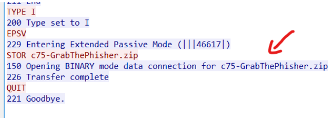

Kemudian kita lihat detail packet tersebut dengan cara yang sama.

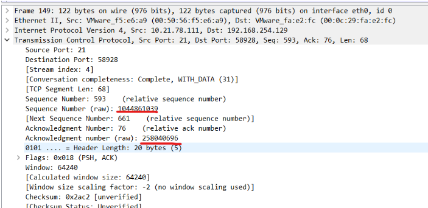

Kemudian, untuk mendapatkan flag yang sesuai, gunakan netcat ke ip dan port yang disediakan pada portal praktikum

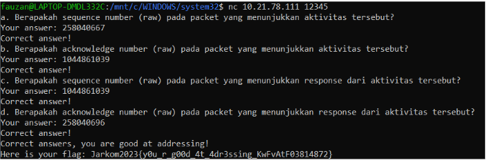

**2. Sebutkan web server yang digunakan pada portal praktikum Jaringan Komputer!**

**Kategori : Stream**

Diketahui portal praktikum jaringan komputer adalah ```http://10.21.78.111/``` atau ```10.21.78.111```. Maka perlu dilakukan filtering berdasarkan http, dengan syntax ```http contains "10.21.78.111"```.

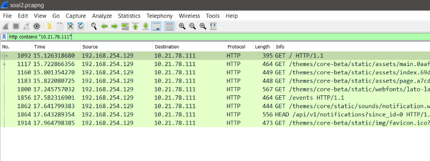

Kemudian, pilih packet paling atas, dan lakukan follow stream.

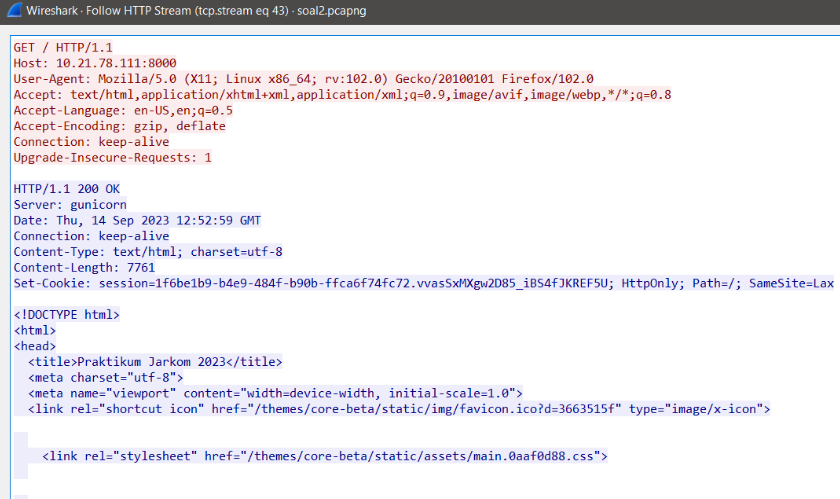

Jelas tertulis web server yang digunakan adalah ```gunicorn```

Gunakan netcat untuk mendapatkan flagnya.

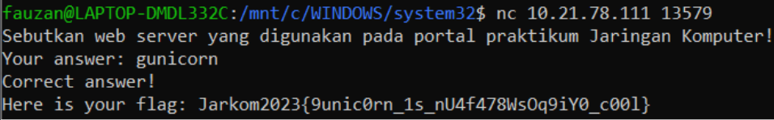

**3. Dapin sedang belajar analisis jaringan. Bantulah Dapin untuk mengerjakan soal berikut:**

**Kategori : Analysis**

* Berapa banyak paket yang tercapture dengan IP source maupun destination address adalah 239.255.255.250 dengan port 3702?
* Protokol layer transport apa yang digunakan?

Untuk mendapatkan berapa banyak paket yang tercapture dengan source atau destinationnya adalah ip tertentu dan port tertentu, dapat menggunakan filter 
terlebih dahulu

```(ip.src ==  239.255.255.250 || ip.dst ==   239.255.255.250) && (udp.port == 3702 || tcp.port == 3702)```

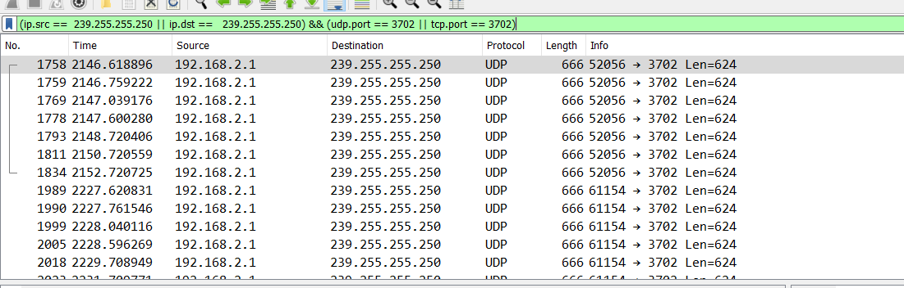

Namun, diperhatikan semua protokol hasilnya adalah UDP, maka dapat diperpendek lagi menjadi 

```(ip.src ==  239.255.255.250 || ip.dst ==   239.255.255.250) && udp.port == 3702```

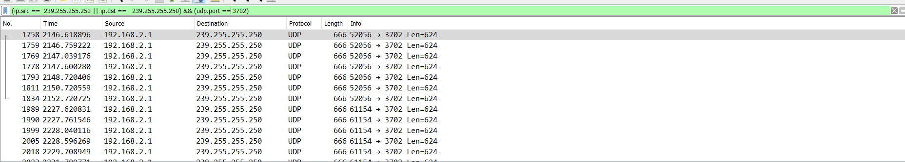

Kemudian, pada interface wireshark, terdapat informasi bahwa paket yang ditunjukkan sebanyak 21.

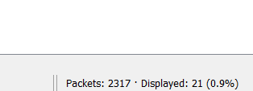

Kesimpulannya, jumlah paket sebanyak 21 dengan protokol layer transport adalah UDP.

Gunakan kembali netcat untuk mendapatkan flag yang sesuai

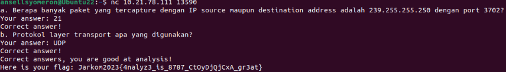

**4. Berapa nilai checksum yang didapat dari header pada paket nomor 130?**

**Kategori :  Analysis**

Untuk menyelesaikan soal ini, perlu mencari paket nomor 130, dan lihat nilai checksum dari
user data protocol.

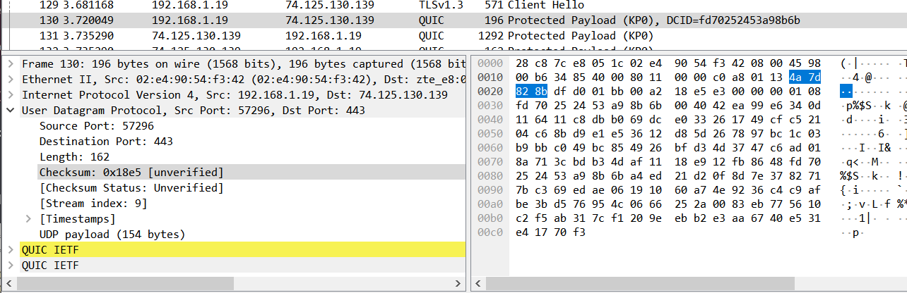

Kemudian gunakan netcat untuk mendapatkan flag yang sesuai

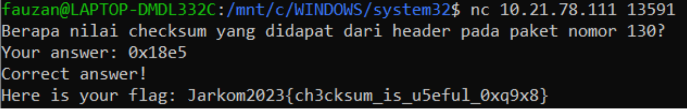

**5. Elshe menemukan suatu file packet capture yang menarik. Bantulah Elshe untuk menganalisis file packet capture tersebut.**

**Kategori :  Analysis**

* Berapa banyak packet yang berhasil di capture dari file pcap tersebut?
* Port berapakah pada server yang digunakan untuk service SMTP?
* Dari semua alamat IP yang tercapture, IP berapakah yang merupakan public IP?

Soal ini agak berbeda, karena tidak diberikan ip dan port netcat untuk mendapatkan file. Probset memberikan dua file, yakni file network capture dan satu .zip.
Namun, zip file yang tertera tidak dapat di-extract tanpa mengetahui suatu password. Maka, perlu dicari terlebih dahulu di dalam file network capture yang diberikan.

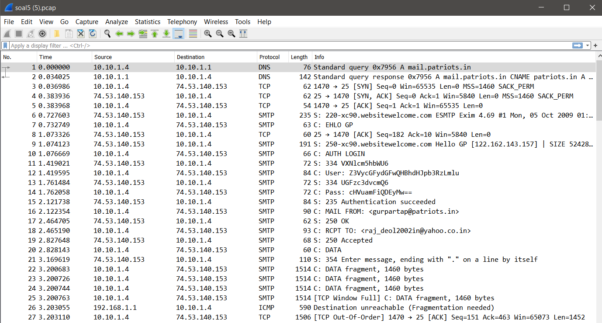

Pada list tersebut terdapat satu packet yang mencurigakan, dimana info berisi : ```Pass : ....``` (paket nomor 14)

Lakukan follow stream pada paket tersebut

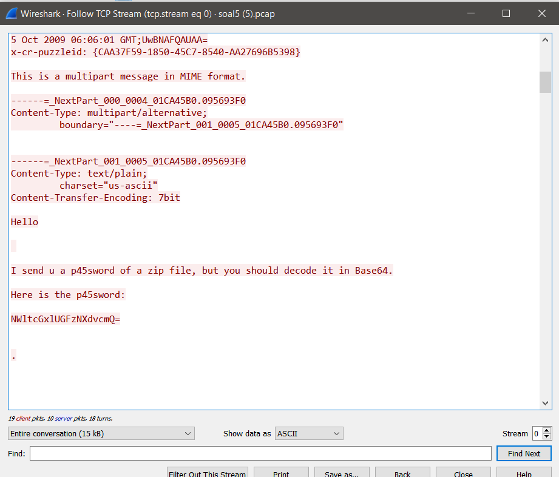

Ditemukan password yang di-encode menggunakan base64 ```NWltcGxlUGFzNXdvcmQ=``` Jika di decode, maka didapatkan ```5implePas5word```.

Lakukan extraction dengan password yang didapatkan.

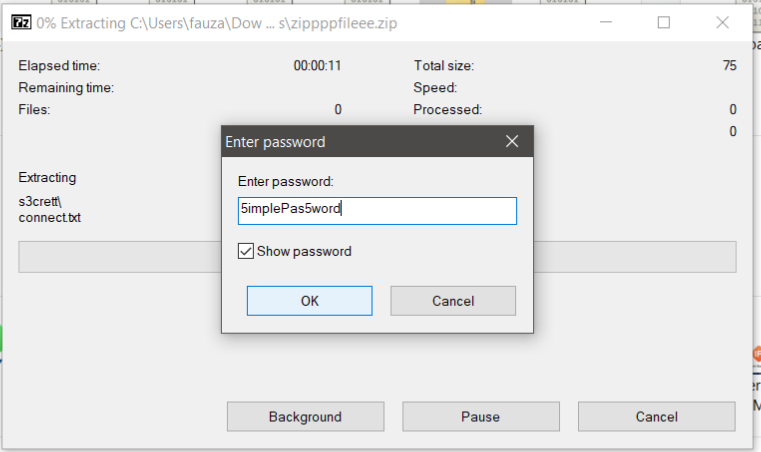

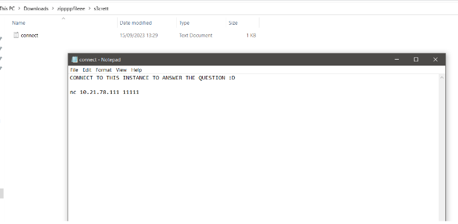

Didapatkan ip netcat dan portnya. Jawab pertanyaan pada netcat tersebut
* 60 paket
* port 25 SMTP
* non-private ip : 74.53.153

Non private ip didapatkan dari
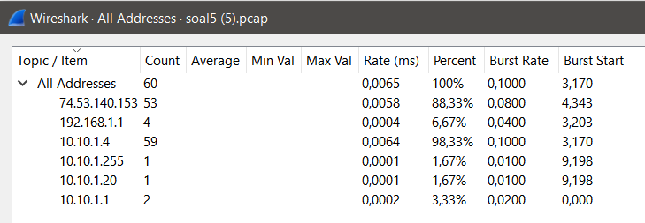

hanya ip tersebut yang public.

Maka akan didapatkan flag : 
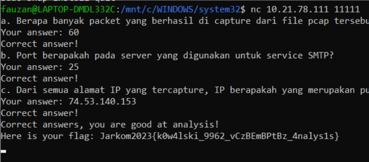


**6. Seorang anak bernama Udin Berteman dengan SlameT yang merupakan seorang penggemar film detektif. sebagai teman yang baik, Ia selalu mengajak slamet untuk bermain valoranT bersama. suatu malam, terjadi sebuah hal yang tak terdUga. ketika udin mereka membuka game tersebut, laptop udin menunjukkan sebuah field text dan Sebuah kode Invalid bertuliskan "server SOURCE ADDRESS 7812 is invalid". ketika ditelusuri di google, hasil pencarian hanya menampilkan a1 e5 u21. jiwa detektif slamet pun bergejolak. bantulah udin dan slamet untuk menemukan solusi kode error tersebut.**

**Kategori : Addressing**

Hints : 
* Lihat huruf besar pada deskripsi soal
* Metode decryption adalah a1z26 cipher
* Range yang dipakai dari 1 - 18 atau A - R. jawaban 6 huruf
* Source Address adalah kunci semuanya.

Pertama, cari paket 7812 dan perhatikan source addressnya

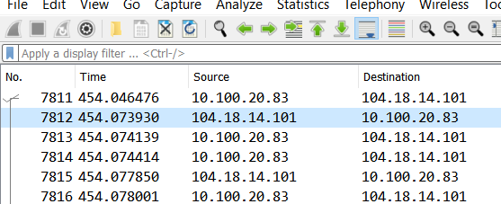

Didapatkan source address ```104.18.14.1```

Dari address tersebut, didapatkan angka 104 18 14 101. Dari hint yang ketiga, range yang dipakai adalah 1 - 18. Maka bisa kita pecah menjadi 6 angka, yaitu 10, 4, 18, 14, 10, dan 1. Angka angka tersebut kita decrypt menggunakan a1z26, menjadi : 

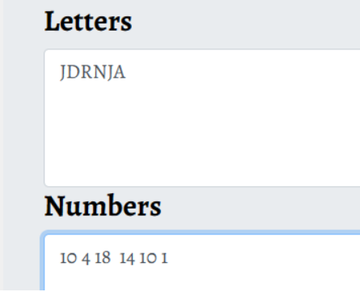


masukan string tersebut ke netcat untuk mendapatkan flag

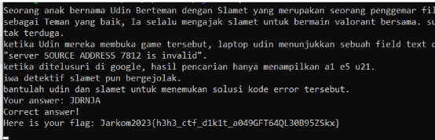
